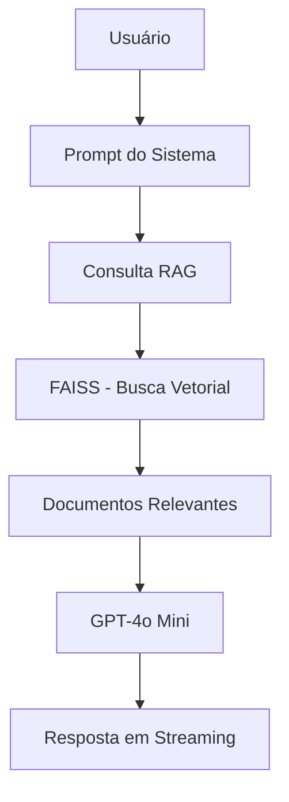

# Max - Assistente Virtual de Entregas


Projeto desenvolvido para estudo de aplicações de IA utilizando Large Language Models (LLMs), Prompt Engineering e Retrieval-Augmented Generation (RAG).

Assistente de atendimento ao cliente que responde com base nas políticas reais da empresa, transfere automaticamente para atendentes humanos quando necessário e mantém contexto durante toda a conversa.

## Objetivo

Desenvolver um assistente virtual baseado em LLMs capaz de responder dúvidas de clientes utilizando Retrieval-Augmented Generation (RAG), simulando um cenário real de atendimento ao cliente.

## Exemplo de conversa

```
Max: Olá! Sou o Max, assistente da XYZ Entregas. Como posso ajudar?

Você: Meu pedido está constando como entregue mas não recebi nada.

Max: Entendo a situação. De acordo com nossas políticas, você deve acionar
o suporte em até 48h após a data de entrega. Abriremos uma investigação
com prazo de 3 dias úteis. Deseja prosseguir com o reenvio ou reembolso?

Você: Quero falar com um atendente.

Max: Aguarde, vou transferir para um atendente.
[Sistema]: Transferindo...
```

## Arquitetura



## Como funciona

Para cada pergunta do usuário, o sistema gera embeddings da consulta e realiza uma busca vetorial utilizando FAISS. Os documentos mais relevantes são recuperados e inseridos no contexto enviado ao GPT-4o Mini, permitindo respostas fundamentadas na base de conhecimento da empresa — não no conhecimento genérico do modelo.

Quando o cliente solicitar falar com um atendente ou o assistente não conseguir resolver o problema, a conversa é encerrada e sinalizada para transferência humana.

## Funcionalidades

- Atendimento automatizado sobre problemas de entrega
- Respostas baseadas nas políticas da empresa via RAG
- Transferência automática para atendente humano quando necessário
- Streaming de respostas em tempo real
- Histórico de conversa durante a sessão

## Tecnologias

- Python 3.10+
- LangChain
- OpenAI API / GPT-4o Mini
- OpenAI Embeddings
- FAISS (banco de vetores)
- python-dotenv

## Estrutura do projeto

```
max-assistente/
├── data/
│   └── politicas.txt       # Base de conhecimento da empresa
├── prompts/
│   └── system.txt          # Personalidade e regras do assistente
├── src/
│   └── main.py             # Código principal
├── .env.example            # Exemplo de variáveis de ambiente
├── .gitignore
├── requirements.txt
└── README.md
```

## Como rodar

1. Clone o repositório
```bash
git clone https://github.com/igormuccio/max-assistente.git
cd max-assistente
```

2. Crie e ative o ambiente virtual
```bash
python -m venv .venv
.venv\Scripts\Activate.ps1  # Windows
source .venv/bin/activate   # Linux/Mac
```

3. Instale as dependências
```bash
pip install -r requirements.txt
```

4. Configure as variáveis de ambiente
```bash
cp .env.example .env
# Adicione sua OPENAI_API_KEY no arquivo .env
```

5. Execute o programa
```bash
python src/main.py
```

## O que explorei neste projeto

- Prompt Engineering para controle do comportamento do modelo
- Integração de um pipeline RAG utilizando LangChain
- Uso de embeddings com OpenAI
- Busca vetorial utilizando FAISS
- Gerenciamento de contexto de conversa
- Streaming de respostas com LangChain
- Organização de projetos Python

## Melhorias futuras

- Persistência do índice FAISS em disco
- Interface Web com Streamlit
- API REST utilizando FastAPI
- Banco vetorial dedicado (Chroma ou Pinecone)
- Testes automatizados
- Docker para facilitar o deploy

## Observações

As políticas presentes em `data/politicas.txt` são fictícias e utilizadas apenas para fins de demonstração.