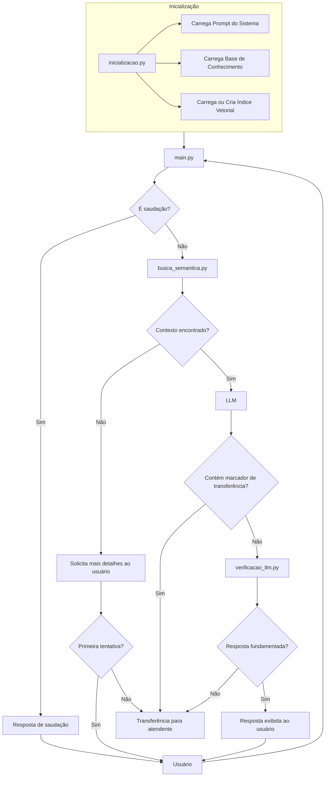

# Max - Assistente Virtual de Entregas


Projeto desenvolvido para estudo de aplicações de IA utilizando Large Language Models (LLMs), Prompt Engineering e Retrieval-Augmented Generation (RAG).

Assistente de atendimento ao cliente que responde com base nas políticas reais da empresa, transfere automaticamente para atendentes humanos quando necessário e mantém contexto durante toda a conversa.

> Além do código-fonte, este projeto documenta os experimentos realizados durante o desenvolvimento — incluindo falhas, hipóteses testadas e decisões arquiteturais recalibradas com dado real. Veja [EXPERIMENTS.md](./EXPERIMENTS.md).

## Objetivo

Desenvolver um assistente virtual de atendimento ao cliente baseado em LLMs e Retrieval-Augmented Generation (RAG), com foco não apenas em fazer o sistema funcionar, mas em entender os limites reais de cada decisão de arquitetura — calibração de parâmetros com dado real, mitigação de alucinação, trade-offs de custo e confiabilidade, e organização de código sustentável.

O projeto simula um cenário real de atendimento (a XYZ Entregas, empresa fictícia). Boa parte do valor deste repositório está no processo de investigação por trás de cada escolha técnica.

## Exemplo de conversa

**Fluxo padrão — pergunta de negócio com contexto encontrado:**
```
Max: Olá! Sou o Max, assistente da XYZ Entregas. Como posso ajudar?

Você: Meu pedido está constando como entregue mas não recebi nada.

Max: Entendo a situação. De acordo com nossas políticas, você deve acionar
o suporte em até 48h após a data de entrega. Abriremos uma investigação
com prazo de 3 dias úteis. Deseja prosseguir com o reenvio ou reembolso?

Você: Quero falar com um atendente.

Max: Aguarde, vou transferir para um atendente.
[Sistema]: Transferindo...
```

**Fluxo de saudação — resposta fixa, sem custo de chamada ao modelo:**
```
Você: oii

Max: Olá! Como posso te ajudar hoje?
```

**Fluxo de contexto não encontrado — reformulação antes de transferir:**
```
Você: qual o horário do próximo jogo do brasileirão

Max: Não entendi muito bem sua pergunta. Você pode explicar de outra
forma, com mais detalhes sobre seu pedido?
```

## Arquitetura



## Como funciona

Antes de qualquer busca, o Max verifica se a mensagem é uma saudação — usando o mesmo mecanismo de embedding do RAG, mas contra uma base pequena de exemplos, sem gastar chamada ao modelo de linguagem para isso.

Para perguntas de negócio, o sistema gera embeddings da consulta e realiza uma busca vetorial utilizando FAISS, com um limiar de relevância mínimo (`score_threshold`). Se nenhum chunk for relevante o suficiente, o Max pede para o cliente reformular; se isso se repetir, a conversa é transferida para um atendente, sem gastar uma chamada de geração em uma pergunta sem contexto útil.

Quando contexto relevante é encontrado, ele é inserido no prompt enviado ao GPT-4o Mini, permitindo respostas fundamentadas na base de conhecimento da empresa — não no conhecimento genérico do modelo. Antes de exibir a resposta, uma segunda chamada ao modelo verifica se ela usa apenas informação presente no contexto (*grounding verification*); se a resposta contiver uma inferência não fundamentada, ela é descartada e a conversa é transferida para um atendente humano, em vez de mostrada ao cliente.

O índice vetorial é persistido em disco e só é recalculado quando a base de conhecimento (`politicas.txt`) é alterada, evitando reprocessamento desnecessário a cada execução.

## Funcionalidades

- Atendimento automatizado sobre problemas de entrega
- Detecção de saudação via embedding, sem custo de chamada ao modelo
- Respostas baseadas nas políticas da empresa via RAG, com limiar de relevância calibrado
- Verificação de grounding: uma segunda checagem que descarta respostas não fundamentadas no contexto
- Fallback de reformulação antes de transferir, para perguntas fora do escopo
- Transferência automática para atendente humano quando necessário
- Persistência do índice vetorial em disco, recalculado apenas quando a base muda
- Streaming de respostas em tempo real
- Histórico de conversa durante a sessão
- Log técnico separado da interface do usuário

## Tecnologias

- Python 3.10+
- LangChain (core, text-splitters, community, openai)
- OpenAI API (GPT-4o Mini)
- OpenAI Embeddings
- FAISS (banco de vetores)
- python-dotenv

## Estrutura do projeto

```
max-assistente/
├── data/
│   ├── politicas.txt         # Base de conhecimento da empresa
│   ├── faiss_index/          # Índice vetorial persistido (gerado, ignorado no Git)
│   └── faiss_metadata.txt    # Controle de atualização do índice (gerado, ignorado no Git)
├── logs/
│   └── app.log                # Log técnico separado da interface do usuário (gerado, ignorado no Git)
├── prompts/
│   └── system.txt             # Personalidade e regras do assistente
├── src/
│   ├── main.py                 # Orquestração e loop de conversa
│   ├── inicializacao.py        # Carregamento de prompt, base de conhecimento e índice de saudação
│   ├── busca_semantica.py      # Busca de contexto e detecção de saudação por embedding
│   └── verificacao_llm.py      # Verificação de grounding (checagem de fundamentação da resposta)
├── .env.example                # Exemplo de variáveis de ambiente
├── .gitignore
├── requirements.txt
├── EXPERIMENTS.md              # Documentação de testes e decisões técnicas
└── README.md
```

## Como rodar

1. Clone o repositório
```bash
git clone https://github.com/igormuccio/max-assistente.git
cd max-assistente
```

2. Crie e ative o ambiente virtual
```bash
python -m venv .venv
.venv\Scripts\Activate.ps1  # Windows
source .venv/bin/activate   # Linux/Mac
```

3. Instale as dependências
```bash
pip install -r requirements.txt
```

4. Configure as variáveis de ambiente
```bash
cp .env.example .env
# Adicione sua OPENAI_API_KEY no arquivo .env
```

5. Execute o programa
```bash
python src/main.py
```

## O que este projeto explora

- Prompt engineering para controle de comportamento, incluindo marcadores de controle e mitigação de regras concorrentes
- Pipeline RAG completo: chunking calibrado, embeddings, busca vetorial com FAISS, limiar de relevância
- Detecção de alucinação e verificação de grounding como camada de segurança
- Trade-offs de custo vs. confiabilidade na escolha de modelo e arquitetura
- Persistência de índice vetorial e separação de logs técnicos
- Organização de projeto em módulos por responsabilidade

Cada uma dessas decisões foi testada empiricamente, não apenas assumida — incluindo casos em que a primeira solução falhou e precisou ser recalibrada. Para o histórico completo de testes, hipóteses e limitações conhecidas, veja [EXPERIMENTS.md](./EXPERIMENTS.md).

## Melhorias futuras

- Eval set automatizado e few-shot prompting, informados pelos casos já mapeados
- Query rewriting ou HyDE para conversas multi-turno, a avaliar com uma base de conhecimento maior
- Interface Web com Streamlit
- API REST utilizando FastAPI
- Banco vetorial dedicado (Chroma ou Pinecone)
- Docker para facilitar o deploy

## Observações

As políticas presentes em `data/politicas.txt` são fictícias e utilizadas apenas para fins de demonstração.
